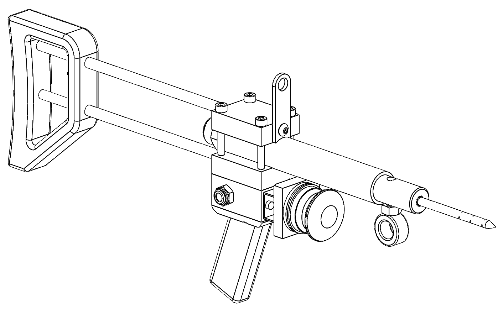
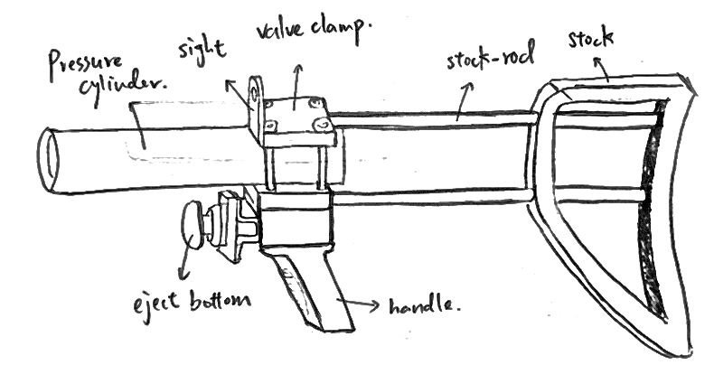
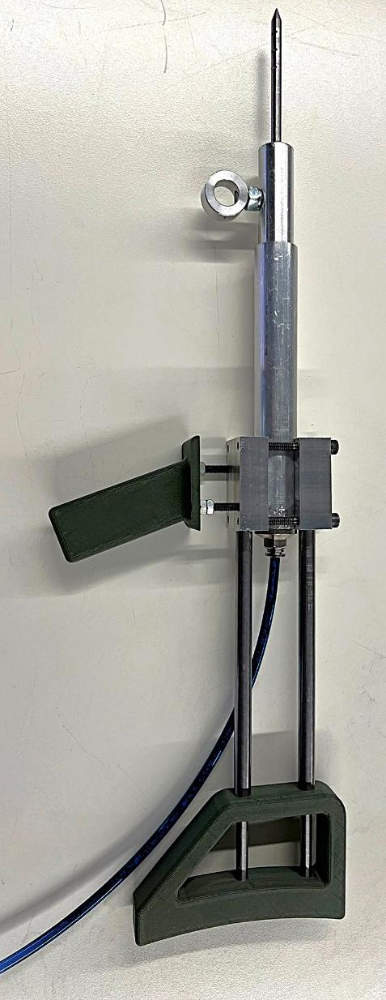
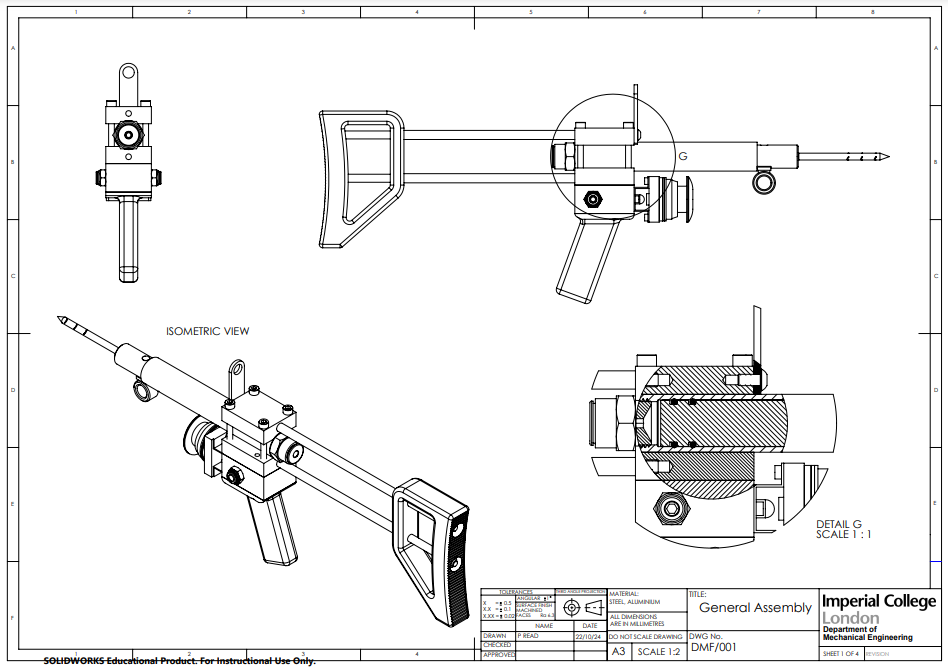
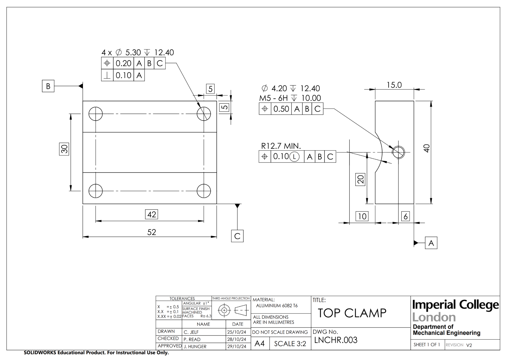
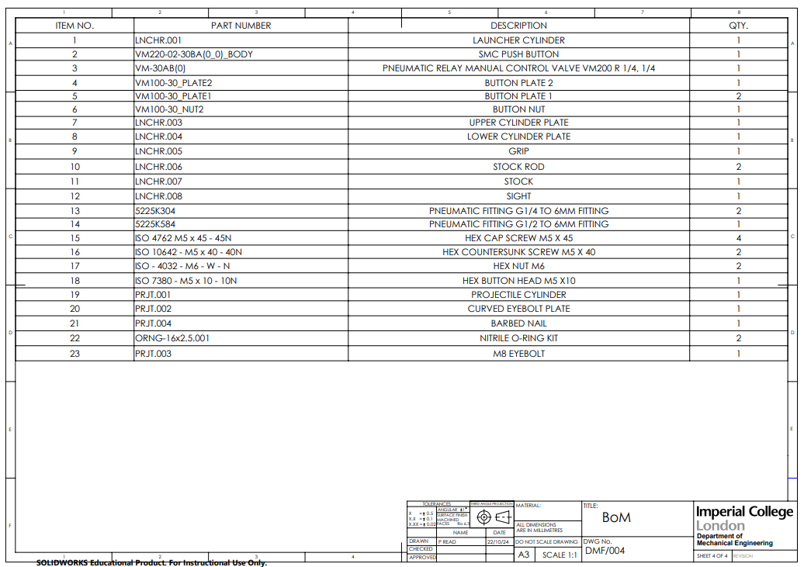

# Rope Bridge Launcher

A design, analysis and manufacturing project for a pneumatic launcher intended to install rope bridges across roads in gibbon habitats. The concept was developed as a scaled prototype inspired by the Lego × New Scientist “Rope Bridge” conservation challenge.

**Course:** P10 Design Report / DMF2, Imperial College London  
**Team:** Five-person mechanical engineering team  
**My reported role:** Projectile Engineer  
**Date:** December 2024  
**Prototype scale:** 1:10 for bridge length and launch distance  
**Prototype budget:** £276.92 against a £300 limit

> This repository documents a scaled engineering prototype. It is not a field-ready wildlife or projectile system; the report identifies further testing and full-scale recalculation as necessary before any real deployment.

## Design brief

The team designed a practical way to install a single-rope bridge between trees beside a rainforest road, giving gibbons a more natural crossing route and reducing road-accident risk. The bridge concept uses one rope, chosen to resemble a branch and support brachiation. The installation concept launches barbed pegs into trees, with the rope attached to one projectile and looped through the second before being tensioned from the ground.

The prototype was designed for a 1.5 m horizontal launch distance, representing a 15 m full-scale installation distance at 1:10 scale. A scaled 5 kg design load represented a family of gibbons at approximately 50 kg full scale.

## Final concept

  

<em>Final pneumatic rope bridge launcher CAD model.</em>

The concept was selected through weighted decision matrices. A pneumatic launcher scored highest against safety, cost, implementation, unobtrusiveness, manufacturability and service life, while the single-rope bridge scored highest among the bridge-layout options.

  

<em>Final launcher concept showing the pressure cylinder, clamps, manual valve, stock, sight and handle.</em>

## Engineering analysis

### Projectile and tree attachment

A 6 mm diameter barbed peg with 50 mm penetration depth was modelled against hardwood with an approximate specific gravity of 0.5. The analysis estimated approximately **500 N** withdrawal force and **25 J** of required projectile energy. The peg used a sharpened 20° tip and backward-angled 45° barbs; the modular design allowed the barb geometry to be changed after testing.

The projectile was arranged like a harpoon, with the centre of gravity positioned at **57.2% of its total length from the tip** to support stable flight. The final attachment used an eyebolt rather than the earlier pulley-and-plate arrangement, simplifying installation and shifting the centre of gravity forward.

### Pneumatic system

The launcher used compressed air because it was non-flammable, non-toxic, available in the workshop and compatible with the budget and manufacturing constraints. The design point used **6 bar** maximum available pressure and a **125 mm** barrel length. A **20.5 mm** internal pressure-cylinder diameter was selected to achieve the required energy within the available reaming constraints.

A calculated minimum system diameter of 2.4 mm led to selection of **4 mm internal-diameter pneumatic hose** to reduce pressure drop. A manual 2/2 valve was selected for simplicity and cost; its stated normalised flow rate gave a calculated flow safety factor of **3.47**.

Two O-rings provided the projectile seal. The reported tolerance analysis gave concentric compression of **13.11–21.39%**, housing fill of **64.21–84.24%**, and stretch of **1.39–4.59%** across the assessed fit conditions.

### Structural checks

- Pressure-cylinder maximum shear stress at 6 bar: **1.72 MPa**.
- Aluminium yield-stress comparison: calculated safety factor **98.8**.
- Barbed-projectile maximum stress under an intentionally severe 70° rope angle: **1.87 MPa**.
- Steel yield-stress comparison: calculated safety factor **133**.

These are calculation-based checks under the report’s assumptions, not substitutes for full experimental qualification.

## Manufacture and verification

The prototype was manufactured in Imperial’s Student Teaching Workshop using the available processes and constraints:

| Component or feature | Material / process |
| --- | --- |
| Pressure cylinders | Aluminium 6082-T6; drilling, reaming, turning and boring |
| Upper and lower clamps | Aluminium 6082-T6; milling and drilling |
| Stock rods | Mild steel; turning |
| Barbed pegs | Steel; turning and grinding |
| Handle / stock | PLA; additive manufacture |
| Sight | Acrylic; laser cutting |
| Rope attachment | Mild steel eyebolt; milling and drilling |

The project manufactured **11 parts** and used design-for-manufacture decomposition to keep each part to essential operations. The measured clamp dimensions were generally reported within tolerance, including top-clamp length **51.79 mm** against 52 mm and bottom-clamp length **52.01 mm** against 52 mm. Several height and threaded-hole operations were recorded as not machined because workshop time ran out.

  

<em>Manufactured prototype as of December 2024.</em>

  

<em>General assembly drawing with orthographic, isometric and section views.</em>

## Safety and limitations

The risk assessment identified hazards from splinters and ricochet, compressed-air release, noise, and recoil. The report proposed shielding, eye and hearing protection, controlled pressurisation, safe pointing and storage practices, and a stock to manage recoil. Those controls are part of the prototype’s test context and do not constitute approval for real-world operation.

The principal limitations were:

- The bridge and launch distance were scaled to 1:10 for indoor demonstration.
- Full-scale projectile dimensions and pneumatic values would need recalculation for the rainforest application.
- The prototype required more rigorous testing after submission.
- Operational launch, penetration, noise and long-term rope performance were not fully validated in the report.
- The ecological, legal and field-installation implications would require specialist review before deployment.

## Engineering drawings and project evidence

  

<em>Example of the dimensioned and toleranced top-clamp drawing.</em>

  

<em>Bill of materials showing a prototype total of £276.92.</em>

[Read the complete design report (PDF) →](docs/Rope_Bridge_Launcher_Design_Report.pdf)

## Skills demonstrated

Concept generation and weighted decision matrices; product design specification; pneumatic system sizing; projectile and pressure-vessel calculations; O-ring fit analysis; CAD and engineering drawings; design for manufacture; milling, turning, reaming, boring, grinding, laser cutting and 3D printing; risk assessment; dimensional inspection; collaborative project management.

## Portfolio link

[Return to the main engineering portfolio →](https://github.com/Jo-YuHuang/Jo-YuHuang)
